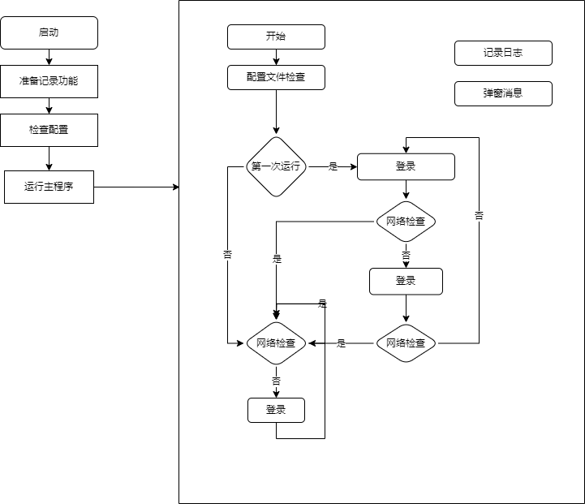

# Auto Connect 开发

环境：Windows10-22H2

语言：Python3.10

版本：内测0.2.1.2.Beta

## 程序逻辑

主要部分如下（用Drawio画的草图，请用白底浏览）



## 模块

### client:程序外壳

&emsp;包装主程序，并对程序运行提供保障

##### &emsp;main

&emsp;主函数

##### &emsp;setBuglog

&emsp;设置bug记录器（内测版本支持）

### main

主程序，程序设计的主要编程

#### Program

&emsp;**current_user** :保存当前系统的登录账户名

##### &emsp;Program.autoLogon

&emsp; 自动登录函数，使用此函数进行登录

&emsp;config:用户配置文件数据, popToast:弹窗主体变量, driver:网络适配器信息

##### &emsp;Program.check

&emsp;用于检查配置文件是否存在（基本）错误。

##### &emsp;Program.checkInternet

&emsp;检查网络函数，使用此函数返回网络检测信息

&emsp;config:用户配置文件数据, popToast:弹窗主体变量, driver:网络适配器信息

##### &emsp;Program.loadConfig

&emsp;加载配置文件，返回配置文件数据

##### &emsp;Program.main

&emsp;编程接口，实现对<code>Program.program</code>的循环调用与结果处理

&emsp;arguement:处理“重试”调用，判断是否是正常调用（暂时没有处理该变量）

##### &emsp;Program.program

&emsp;调用<code>Program.loadConfig</code>,<code>Program.checkInternet</code>,<code>Program.autoLogon</code>实现程序功能

&emsp;checkInterne:是否检查网络，用于程序启动后跳过网络检测，立即登录

##### &emsp;Program.setshortcut

&emsp;在用户桌面和“开始菜单”创建快捷方式、注册AMUID

&emsp;deskLinkPath, startLinkPath分别为桌面快捷方式和开始菜单快捷方式路径

&emsp;*仅在缺失“开始菜单”**快捷方式**时启用* 

##### &emsp;Program.writeConfig

&emsp;保存新的配置信息

&emsp;key:信息对应的键, value:信息的内容

##### &emsp;Program.writeLog

&emsp;写入日志，在控制台输出信息

&emsp;*args为日志信息

### control: 系统接口

主要功能是调用系统功能对系统进行操作或查询系统信息，例如测试网络、连接WIFI

#### systemStatu

&emsp;**runCount** :用于计数程序运行成功的次数，1为开始，2为第一次成功

##### &emsp;systemStatu.relaxTime

&emsp;计算返回**程序运行时长** ,**距离上一次运行成功的时长**，**两次调用该函数的时差**

&emsp;update:是否更新运行成功的时刻

##### &emsp;systemStatu.internetTest

&emsp;测试系统网络，并返回网络报告，报告形式如下：

```Python
{
     网络是否连通 'internets': , 电脑是否登录(校园网) 'isLogin': , 
     网络适配器:
     {
         网络适配器数量, 适配器1, 适配器2, ···
     }
}
```


&emsp;checkLogon: 是否检查登录情况，选择否可以减小服务器压力

##### &emsp;systemStatu.connect_WLAN

&emsp;按需连接WIFI（实际上还不支持选择接口）

&emsp;allowWLAN: 用户配置的允许连接的网络, scanResult: 附近的WLAN, interface: 选择的接口

##### &emsp;systemStatu.connectWLAN 

&emsp;扫描WIFI与调用<code>systemStatu.connect_WLAN</code>来连接WIFI

&emsp;allowWLAN: 用户配置的允许连接的网络，用来传递给<code>systemStatu.connect_WLAN</code>

### logonServer: 服务接口

#### NetConnect

##### &emsp;NetConnect.logonServer

&emsp;服务登录函数，使用此函数登录校园网. 返回userIndex和query

&emsp;userId: 用户ID(默认为学号), password: 密码, encrtpted: 密码是否经过学校密钥加密

##### &emsp;NetConnect.accontInfo

&emsp;获取用户信息，返回以下信息:

> &emsp;apMac, message, portalIp, realServiceName, redirectUrl, result, userGroup, userId, userIndex, userIp, userMac, userName, userPackage, welcomeTip

&emsp;userIndex: 用户识别码(由服务器提供), rebreak: 防止无限递归

##### &emsp;systemStatu.EncryptPassword

&emsp;获取密钥对密码进行加密，返回加密后的密码。调用**encrypt** 库

### deskToast: 通知消息

主要来自 windows_toasts 库, 官方文档在[此](https://windows-toasts.readthedocs.io/en/latest/index.html)

#### Popup: 

&emsp;**Popup.basicNewToast**: 基础通知消息类型

&emsp;**Popup.newToast**: 动态通知消息类型

&emsp;**Popup.callbackFunc**: 指定回调函数

> title: 通知标题, body: 通知内容, head: 通知内容/进度条内容, left: 进度条进度信息, progress: 进度条进度, right: 进度条目的信息, update: 是否更新信息/通知消息，确认调用函数

##### &emsp;Popup.Process

&emsp;显示/更新**动态通知消息** 

##### &emsp; Popup.Basic

&emsp;显示/更新**基础通知消息** ，会清除之前的**动态通知消息** 

##### &emsp;Popup.ActionBasic

&emsp;显示/更新**基础通知消息** ，会清除之前的**动态通知消息** 。支持“重试”操作

##### &emsp;Popup.toastReset

&emsp;为需要的通知消息进行内容更新

##### &emsp;Popup.setCallback

&emsp;“重试”的默认回调函数

### encrypt: RAS加密

模拟JavaScript对密码进行RAS加密，[前端RSA工具security.js](https://blog.csdn.net/qq_45829350/article/details/107157966)

#### encrypt

##### &emsp;encrypt.encryptPsw

&emsp;获取参数，调用<code>encrypt.rsa_passwd_get</code>对密码进行加密，返回加密和的密码

&emsp;password: 待加密密码, publicKeyExponent, publicKeyModulus

##### &emsp;encrypt.rsa_passwd_get

&emsp;允许JavaScript代码对密码进行加密，返回加密后的代码

*所有返回值以Report形式或者bool或者字符串*

## 测试

目前已经经过以下测试

|      | 开机登录 | 有线连接 | 有线登录 | 无线开启 | 无线连接 | 热点存在 | 无线登录 | 配置存在 | 配置正确 | 结果 |
| ---- | :------: | :------: | :------: | :------: | :------: | :------: | :------: | :------: | :------: | :--: |
| 1    |    o     |    o     |    x     |    x     |          |          |    x     |    o     |    o     |  o   |
| 2    |    o     |    x     |    x     |    x     |          |          |    x     |    o     |    o     |  o   |
| 3    |    o     |    x     |    x     |    o     |    o     |    o     |    x     |    o     |    o     |  o   |
| 4    |    o     |    x     |    x     |    o     |    x     |    o     |    x     |    o     |    o     |  o   |
| 5    |    o     |    x     |    x     |    o     |    x     |    x     |    x     |    o     |    o     |  o   |
| 6    |    o     |    o     |    o     |    o     |    o     |    o     |    o     |    o     |    o     |  o   |
| 7    |    o     |    x     |    x     |    o     |    o     |    o     |    o     |    o     |    o     |  o   |
| 8    |    o     |    o     |    x     |    x     |    x     |          |    x     |    x     |          |  o   |
| 9    |    o     |    x     |    x     |    o     |    o     |    o     |    o     |    x     |          |  o   |
| 10   |    o     |    x     |    x     |    x     |    x     |          |    o     |    o     |    x     |  o   |
| 11   |    x     |    o     |    x     |    x     |    x     |          |    x     |    o     |    o     |  o   |

| 序号 | 其他                      | 结果 |
| ---- | ------------------------- | ---- |
| 12   | 弹窗测试                  | o    |
| 13   | 弹窗交互测试              | o    |
| 14   | 实时配置修改              | o    |
| 15   | 日志和调试功能            | o    |
| 16   | bug记录功能（内测版支持） | o    |
| 17   | 无视代理测试              | o    |
| 18   | 无感使用测试              | -    |

## 其他问题

### 运行条件

1. Windows系统刚开机时部分组建是加载不完全的，我们只能适应运行环境。使用try来尝试，失败后就等待
2. Windows系统的WLAN控制我还不清楚是什么原理，我暂时没有较好的办法控制WLAN功能的开启

### 编程不足

目前已知：

1. 在加载/写入文件，例如:配置文件、日志时没有进行锁定和检查，以及对加载/写入进行错误。
2. 有时候基础通知消息还会出错

还有一些我的无知

### 特别之处

有几个特别难:

1. 使用JavaScript的**RSA****工具security.js** 对密码进行加密，使用python  rsa加密的算法和结果与我们需要的不同。
2. 需要AMUID，目前只知道在“开始·菜单”中创建快捷方式来注册。（默认使用命令行AMUID）
3. 在toast库中的文本显示和文档说明的有点不一样。
4. bug捕获存在main中调用的其他非自己写的库存在logging的使用
5. wifi模块无法获取WLAN功能的开关状态，无法打开WLAN功能

### 历史

这也是我在探索制作完整程序的一部分，有问题欢迎反馈

2023-5-11 开始0.2.0.1版本制作

2023-5-13 开始0.2.0.1版本测试

2023-5-14 开始0.2.0.2版本制作

1. 增加了程序对非校园网的检测
2. 修复了部分弹窗信息错误的问题

2023-5-14 开始0.2.0.2版本测试

2023-5-15 开始0.2.1.0版本制作

1. 改用ping3检测网络
2. 添加启动即连的功能，加快联网速度

2023-5-15 开始0.2.1.0版本测试

2023-5-16 开始0.2.1.1版本制作

1. 增加开机时无法创建的连接的应对方法
2. 取消scoker检查网络

2023-5-16 开始0.2.1.1版本制作

2023-5-17 更新0.2.1.2版本

1. 优化代码
2. 优化日志记录功能
3. 合并JavaScript RSAUtils库，实现同学校的RAS密码加密
4. 弃用错误类型（我不确定该不该这么做）
5. 修复了loadcofig函数中一fan个return缺失值的隐藏bug
6. 取消了只有待机后才能执行下一次联网的设置

2023-5-20 登录判断的另一种方法

方法：request特殊的地址，通过返回码来判断是否登录

状态：考虑过。该程序有一个特别之处——它需要频繁检测网络连通性，ping3比request来的更高效；通过request本地的aaa服务器来的也快，更准确。

2023-5-21 发现问题

存在“由于系统缓冲区空间不足或队列已满，不能执行套接字上的操作”导致的程序崩溃，目前没用检测到问题来自本程序，将在找到问题后修复。该问题的应对方法请上网搜索，顺带了解这个问题的更多内容。
